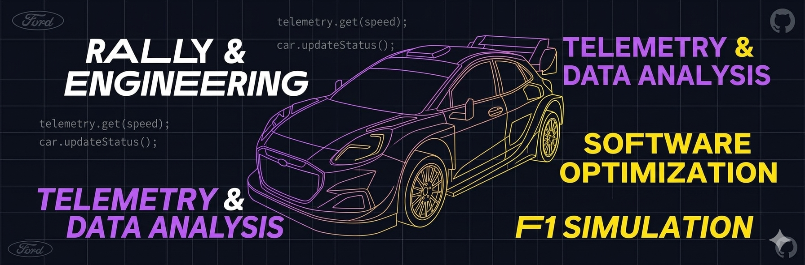
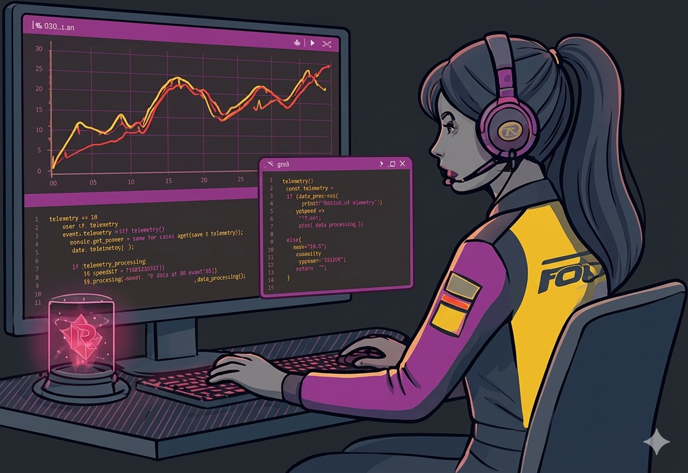
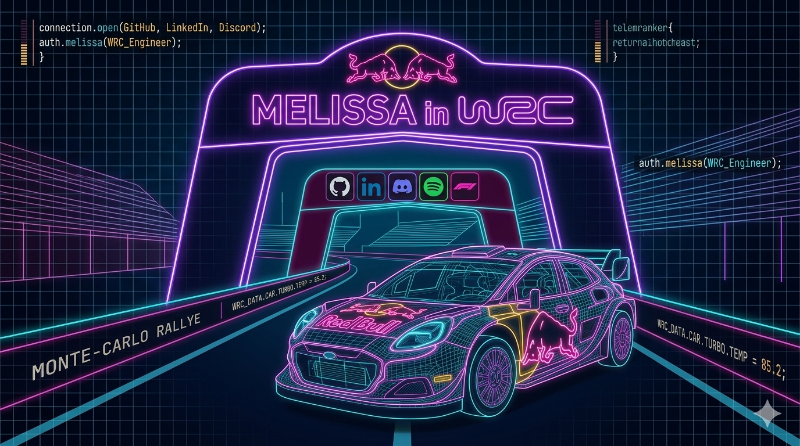

  
  
  <h1 align="center">Melissa's WRC Lab 🙏</h1>
  
<b>Building digital engines for speed and efficiency</b>

Currently a master Computer Engineering student. My academic and personal work focuses on Software development and its application to <b>real-time performance optimization</b>.

 

<table border="0">
  <tr>
    <td width="60%" valign="top">
      <h3>💫 About Me</h3>
      <ul>
        <li>🔧 <b>Working on:</b> Real-time telemetry processing algorithms.</li>
        <li>📚 <b>Specializing in:</b> High-performance computing and C++.</li>
        <li>⚡ <b>Passionate about:</b> Combining engineering precision with racing passion.</li>
        <li>🚀 <b>Building:</b> Open-source tools for racing data analysts.</li>
      </ul>
    </td>
    <td width="40%" align="center">
      
    </td>
  </tr>
</table>

 

  <h3>📊 GitHub Status</h3>
  
  

 

  <h3>🧪 Languages & Tools</h3>
  

 

  <h3>Connect with me</h3>
  

